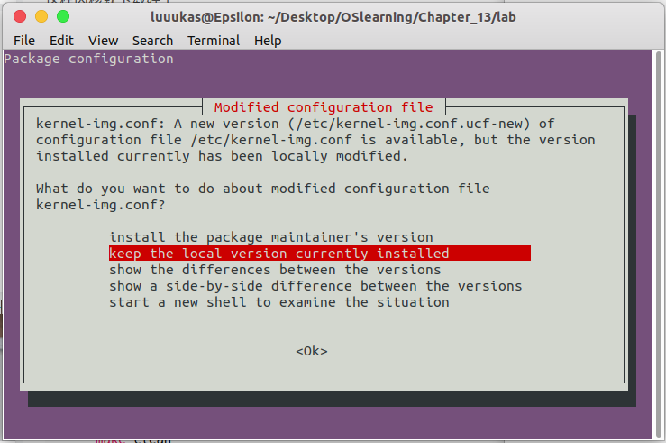
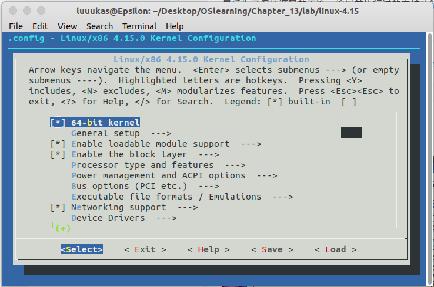

# 添加系统调用

## 实验环境

VMware Workstation Pro 14

```bash
luuukas@Epsilon:~$ lsb_release -a
No LSB modules are available.
Distributor ID:	Ubuntu
Description:	Ubuntu 18.10
Release:	18.10
Codename:	cosmic
```

## 下载内核

[linux-4.15.tar.gz](http://mirrors.aliyun.com/linux-kernel/v4.x/linux-4.15.tar.gz)

```bash
sudo tar -xzf linux-4.15.tar.gz
```

```bash
sudo chmod -R 777 linux-4.15
```

## 安装依赖

build-essential （基本的编程库（gcc, make等））
kernel-package （Debian 系统里生成 kernel-image 的一些配置文件和工具）
libncurses5-dev （meke menuconfig要调用的）

```bash
sudo apt-get install build-essential kernel-package libncurses5-dev
```

有可能出现如下情况



```bash
cd linux-4.15
```

```bash
make menuconfig
```



为了保证源码的干净，将以前执行过的内核功能选择删除，执行

```bash
make mrproper
```

如果想要删除前一次编译过程的残留数据，执行

```bash
make clean
```

## 在该界面中对内核功能进行选择

## 编译内核

```bash
# 用j2、j4加快编译
make -j2
```

编译过程中可能回提示缺了什么XX依赖，如下安装依赖

```bash
sudo apt-get install XX
```

## 编译模块

```bash
make modules
```

