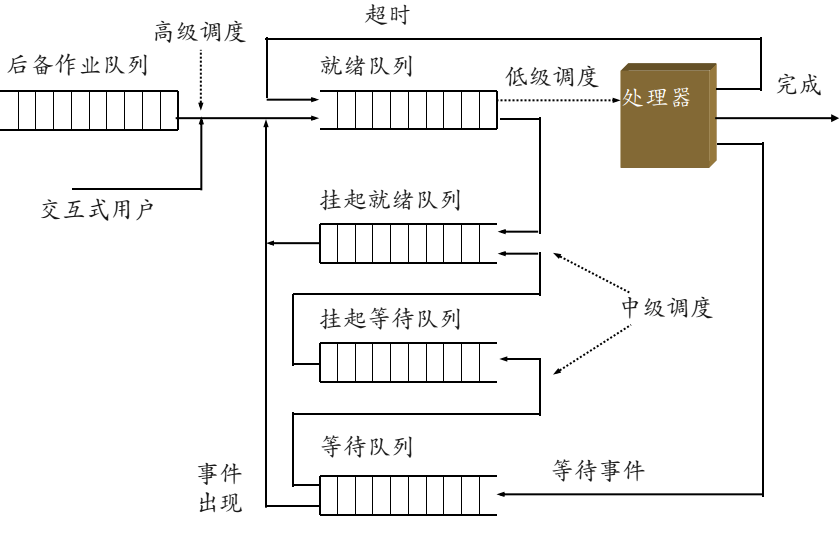

## 调度策略和调度机制

​	CPU调度按照层次可分3级：高级调度、中级调度和低级调度，这里仅讨论**低级调度**。低级调度的最初对象是进程，随着多线程机制的引入，一些操作系统中进程演变成资源分配和保护单位，从而进程只作为中级调度对象，内核级线程则替代进程称为低级调度对象。适合于进程调度的算法一般都适用于内核级线程调度。



​	CPU调度指的是在一组就绪的进程/线程中进行CPU分配，采用多道程序设计的操作系统中，在一段时间间隔内，允许多个进程加载到主存中，并通过时分复用（时间片）技术让在主存的进程/线程共享CPU。当一个进程/线程执行结束、或等待某事件发生而进入阻塞状态时，由调度程序将CPU分配给另一个进程/线程运行。在操作系统控制下，通常有许多进程/线程处于就绪状态，当CPU变成可用时，调度程序从就绪队列中选择一个来使用CPU。操作系统的调度程序（scheduler）有两项人物：**调度**和**分派**。前者实现**调度策略（scheduling policy）**确定就绪进程/线程竞争使用CPU的次序的裁决原则，即进程/线程何时应放弃CPU和选择哪个来执行；后者实现**调度机制（scheduling mechanism）**确定如何时分复用CPU，处理上下文交换细节，完成进程/线程和CPU的绑定与放弃的具体工作。

​	从概念上看，调度机制由3个逻辑功能程序模块组成。

* 队列管理程序。当一个进程/线程变为就绪时，会更新其进程控制快（PCB）来反映这种变化，队列管理程序（queuer）将PCB指针放入等待CPU的进程列表中，每当把进程/线程移入就绪队列时，可计算为该进程/线程分配CPU的优先级。
* 上下文切换程序。当调度程序把CPU从正在执行的进程/线程使剥夺切换到另一个进程/线程执行时，上下文切换程序（context switcher）将当前执行进程/线程的上下文信息保存到它的PCB中，恢复选中进程/线程的上下文信息，从而，让它占用CPU运行。
* 分派程序。当一个进程/线程出让CPU后，分派程序（dispatcher）被激活，当然，为了运行分派程序，需要把它的上下文装入CPU，分派程序从就绪队列中选择进程/线程，而后，完成从它自己到选择的进程/线程间的又一次上下文切换，把CPU出让给选中的进程/线程。

​	低级调度的基本类型指调度策略中选择下一个运行进程的时间点和仲裁方式，在其他时间不能改变已获得CPU的进程/线程的分派情况，据此有两类基本调度方式。

* 剥夺式（Preemptive）：当进程/线程正在CPU上执行时，系统可根据规定的原则剥夺分配给它的CPU，把其移入就绪队列，选择其他进程/线程运行。常用的有两种CPU剥夺原则，一是高优先级进程/线程可剥夺低优先级进程/线程，二是当运行进程/线程时间片用完后被剥夺，在动态改变进程/线程优先级的系统中，经常出现这种情况。
* 非剥夺式（Nonpreemptive）：一旦某个进程/线程开始执行后便不再让出CPU，除非该进程/线程运行结束、或主动放弃CPU、或发生某个时间不能再继续执行。

​	Linux 2.6与Linux 2.4采用的调度策略有所不同。Linux 2.4的调度程序有很多不足之处，Linux 2.6内核使用新的调度算法，称为O(1)调度算法，它在高负载情况下的执行极其出色，且在SMP中也可以很好地扩展。

## Linux 2.4的调度算法及其不足

​	在v2.4调度算法中，所有处于就绪态的进程都被放入同一个队列中，即使在SMP环境下也只有一个就绪队列，当进行CPU调度时，需要遍历进程就绪队列，执行循环直到找到优先级最高的进程。如果所有准备进行调度的进程时间片耗尽，需要对就绪队列中的每个进程都重新计算时间片，然后返回前面的调度过程，重新在就绪队列中查找优先级最高的进程，让它占有CPU执行。该算法明显的不足有以下几方面。

* 每次调度时都需要遍历所有就绪态进程，需要耗费O(n)的时间。如果处于就绪态的进程非常多，遍历的效率十分低。
* 多个CPU共享一个就绪队列，每个CPU在访问就绪队列时都需要进行加锁操作，当一个CPU在调度进程，而其他CPU处于空闲时，其他CPU也只能等待。这样大大降低了调度算法在SMP环境中的效率。
* 进程可能在多个CPU上切换，由于多CPU共享同一个就绪态队列，一个进程可能在一个时间片用完之后被调度到另外CPU上执行，进程在不同CPU上切换降低CPU缓存的效率，从而降低了系统性能。

## Linux 2.6调度算法的设计与实现

### 运行队列

​	Linux 2.6的调度算法称为O(1)算法，不论就绪进程与CPU的个数多少，调度进程的调度开销总是恒定的常数。每个CPU都有一个运行队列（renqueue），它是给定CPU上的可执行进程的链表，每个就绪进程都唯一归属于一个运行队列。此外，运行队列中还包含每个CPU的调度信息，运行队列的定义如下：

```c
struct runqueue{
    spinlock_t lock;    // 本CPU上的运行队列自旋锁
    unsigned long nr_running;    // 本CPU上活跃、过期队列就绪进程总数
    unsigned long cpu_load;    // 各处理器上的负载
    unsigned long long nr_switches;    // 本CPU上发生的上下文切换数
    unsigned long long timestamp_last_tick;    // 本就绪队列发生调度时间
    unsigned long expired_timestamp;    // 进程耗完时间片事件的时间
    unsigned long nr_uninterruptible;    // 本CPU上不可中断阻塞态的进程数
    struct mm_struct *prev_mm;    // 前面运行进程的active_mm指针
    prio_array_t *active, *expired;    // 指向活动、过期优先级数组的指针
    prio_array_t arrays[2];    // 活跃、过期两类优先级数组
    int best_expired_prio;    // 过期队列中进程最高优先级（数值最小）
    int active_balance;    // 平衡CPU负载使用
    int push_cpu;
    task_t *curr, *idle;    // 该处理器当前运行和空进程
    task_t *migration_thread;    // 处理器上的迁移进程
    struct list_head *migration_queue;    // 处理器上的迁移进程队列
    atomic_t *nr_iowait;    // 本CPU上等待I/O的进程数
};
```

​	内核为每个运行队列维持调度用的数据结构，称优先级数组arrays[]：一个是活跃的（active）、一个是过期的（expired），每个成员内含140个双向链表，相同优先级的进程链接在同一个双向链表里，指针active和expired分别指向arrays的成员。进程调度时从指针active指向的arrays[]的成员里选择下一个要运行的进程。当非实时进程的事件片用完后，就会被移到指针expired指向的arrays[]的成员的双向链表里。prio_array的定义如下：

```c
struct prio_array{
    unsigned int nr_active;    // 数组中的进程数
    unsigned long bitmap[BITMAP_SIZE];    // 优先级位图
    struct list_head queue[MAX_PRIO];    // 优先级队列
}
```

​	在优先级数组中，由一个长度为MAX_PRIO（默认值为140）的数组，数组中的每一个元素是一个链表。链表中放入的是具有相同优先级的就绪态进程。优先级为n的进程将被放入queue[n]中。系统中定义的优先级为0～139，0为最高优先级，139为最低优先级。Linux在进行调度时，将从活跃优先级队列中挑选一个优先级最高的进程执行。为了不扫描活跃优先级队列中的所有进程，优先级数组提供了一个优先级位图，它能够帮助调度器在O(1)时间内找到优先级最高的进程。位图中的每一个对应一个优先级链表，如果位图中该位为0，则说明链表为空；反之说明链表中有处于就绪态的进程。在优先级位图的定义中，BITMAP_SIZE的默认值为5，所以bitmap共含有5个长整形，在32位计算机上共有160位（其中20位被放弃不用）。最后，nr_active指示该优先级数组内可执行的进程的个数。

​	初始化时，位图都被设置位0，并且所有的运行队列都为空，当一个进程就绪时，将它放到合适的优先级队列，位图中相应位就被置1，这样，查找系统中最高优先级就变成了查找位图中被设置的第1个位。因为优先级个数是个定值，所以查找时间恒定，并不受系统到底有多少进程的影响，Linux对它支持的每一种体系结构都提供了对应的快速查找算法sched_find_first_bit()。

​	在运行队列中分别有活跃与过期优先级队列，这两个队列中放置的都是就绪态进程，它们的不同之处在与：时间片尚未用完的就绪态进程被放置在活跃优先级队列中，因此调度器只要在活跃优先级队列中取得的进程都是可运行、并且还有可用时间片的进程。当进程的时间片用完后，它会被放入过期优先级队列，并重新计算进程应该分得的时间片，当活跃优先级队列中的进程都执行完毕以后，所有的就绪态进程都进入过期优先级队列，而在过期优先级队列中的进程都是计算完时间片的。调度器这时只需要将活跃队列与过期队列的指针交换，即原来的过期队列变成活跃队列，原来的活跃队列变成过期队列，重新在活跃队列上进行调度。

​	通过以上算法，调度器能够在O(1)时间完成进程调度，且对于SMP有良好的可伸缩性和亲和性，达到了Linux 2.6调度算法的设计目标。

### 进程优先级

### 时间片

### O(1)调度算法

​	Linux中进程调度分为直接调度和被动调度。

1. 直接调度

   ​	当进程因等待资源而需要转为阻塞状态时，直接调用schedule()进入调度，该函数的执行结果往往是当前进程放弃CPU。这时的执行步骤如下：

   1. 把current指向的当前进程投入相应等待读列。
   2. 把当前进程的状态改为TASK_INTERRUPTIBLE或TASK_UNINTERRUPTIBLE。
   3. 调用schedule()函数选择信进程占有CPU。
   4. 检查并发现所需资源可用后，把当前进程从等待队列值里删除。

2. 被动调度

   ​	当前进程时间片用完后，或当一个进程被唤醒且其优先级高于当前进程的优先级时，通过将TIF_NEED_RESCHED位置1，来告诉内核在适当的时刻需要重新调度。此外，进程执行函数，状态发生变化，将转入调度，这类函数有set_scheduler()、yield()、pause()、sleep()、wait()和exit()。

### 负载平衡

​	系统中每个CPU具有自己的运行队列，它只对属于自己的这些进程进行调度，如果运行队列出现负载不均时，由负载平衡程序load_balance来解决这个问题。它有两种调度方法，在schedule()执行时，只要当前可运行队列空就会被调用，找到一些就绪进程并且插入到这个队列里；它还会被定时器调用，每隔适当时间调用一次，这时需要解决所有运行队列间的失衡问题。

​	load_balance()函数工作时需要锁住当前CPU的运行队列并屏蔽中断，以避免出现竞争条件，负载平衡进程完成后，需解除对当前运行队列的锁定并开放中断。

### 用户抢占和内核抢占

​	内核即将返回用户空间时，如果TIF_NEED_RESCHED标志被设置，会导致调用schedule()，此时就会让刚被唤醒的高优先级进程尽快获得CPU，发生了用户抢占。这时内核知道自己是安全的，因为既然可以继续去执行当前进程，那么也可以选择一个新的进程运行。用户抢占发生在从系统调用返回用户空间时，以及从中断处理程序返回用户空间时。

​	Linux 2.6完整地支持内核抢占，只要重新调度是安全的，内核就可以在任何时间抢占正在运行的进程。那么何时重新调度是安全的呢？只要没有持有锁，内核就可以进行抢占。锁是非抢占区域的标志。由与内核是支持SMP的，所以，如果没有持有锁，正在运行的代码是可重入的、也就是可以抢占的。

​	为了支持内核抢占所作的修改是在每个进程的thread_info中引入preempt_count计数器，其初始值为0，每当使用锁的时候数值加1，释放锁的时候数值减1。当数值为0时，内核就可执行抢占。从中断返回内核空间的时候，内核会检查TIF_NEED_RESCHDE和preempt_count的值，如果TIF_NEED_RESCHED被设置，并且preempt_count为0，这说明有一个更为重要的进程需要运行并且可以安全地抢占，此时就会调用调度程序。如果preempt_count不为0，说明有当前进程持有锁，抢占是不安全的。这时，就会像通常那样直接从中断返回当前执行进程。如果当前进程持有的所有的锁都被释放了，那么preempt_count就会重新为0。此时，释放锁的代码会检查TIF_NEED_RESCHED是否被设置，如果是的画，就会调用调度程序。内核抢占会发生在：

* 当从中断处理程序返回内核空间的时候。
* 当内核代码再一次具有可抢占性的时候。
* 如果内核中的进程显式调用schedule()。
* 如果内核中的进程阻塞，同样会调用schedule()。

​	有些内核代码需要允许或禁止内核抢占，可通过preempt_disable()和preempt_enable()实现。由于内核是可抢占的，内核中的进程在任何时刻都可能停下来以便另一个具有更高优先级的进程运行。这意味着一个进程与被抢占的进程可能会在同一个临界区运行。为了避免这类情况，**内核抢占代码使用自旋锁作为非抢占区域的标记**。如果一个自旋锁被持有，内核便不能进行抢占。因为内核抢占和SMP面对相同的并发问题，并且内核已经是SMP安全的，因此，这种简单的变化使内核也是抢占安全的。