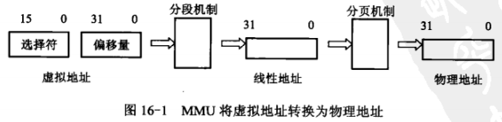
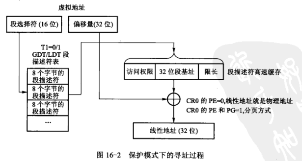
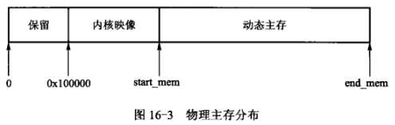
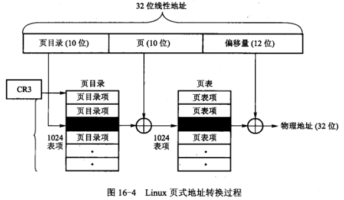
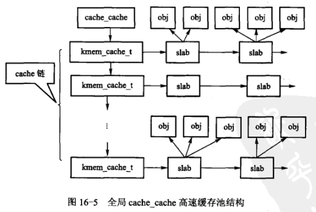

## x86的分段机制

​	在x86 CPU中，分段机制是实现虚拟主存的基本单元。在保护模式下，通过硬件地址主存管理单元（Memory Management Unit，MMU）将**虚拟地址**转换为物理地址的过程如果16-1所示，分页机制再将**线性地址**转换为**物理地址**。

​	在x86 CPU中，虚拟地址指应用程序变成地址空间中的地址，一般用“选择符：偏移量”的形式来规定，通过选择符可得到段基地址、由段基地址和段内偏移量组成的地址也称为逻辑地址；线性地址是指一段连续且不可分段的、由32位无符号整数表示的、范围为0～4GB的地址空间中的一个绝对地址；物理地址指硬件主存提供的物理主存空间中的主存单元地址，用于芯片级主存单元寻址。

### 分段机制

​	**MMU的分段机制将虚拟地址转换为线性地址**，为了实现这种映射，仅仅用段寄存器来确定一个基地址是不够的，为此设计两张表：**局部描述符表（Local Descriptor Table，LDT）**和**全局描述符表（Global Descriptor Table，GDT）**，每个描述符占8个字节，其中包括基地址32位、界限20位和属性12位。由此可以想到，段寄存器中应该存放索引，索引表示段描述符在描述符表中的位置，因此段寄存器的内容也称选择符，它的3个域用来指定：索引值、全局描述符表还是局部描述符表、特权别。

### 分页机制

​	分页机制在分段机制之后工作，以完成从线性地址到物理地址的转换。分段机制把虚拟地址转换为线性地址，分页机制再进一步把线性地址转换为物理地址。如果不允许分页（CR0的最高位置0），那么经分段机制转换而来的32位线性地址就是物理地址；如果允许分页（CR0的最高位置1），就要将32位线性地址通过MMU地址转换部件转换成物理地址。

## 物理存储管理

### 管理区和页框

​	物理主存是系统中十分宝贵的资源。在操作系统的启动过程中，内核需要对主存进行初始化，并对其建立相应的管理数据结构。初始化完成后，物理主存的分布如图16-3所示。

​	从图16-3中可知，在初始化结束后，系统中可分配的主存是从start_mem开始，到end_mem结束。

​	**在Linux中，主存的分配与管理以页框为单位，一个页框的大小为4KB**。在理想情况中，物理主存中的每个页框都应该一样，使用上不应该有限制，但在实际的计算机体系结构中，页框的使用是受限制的。例如，在Inter 32体系结构中，ISA总线的直接存储器存取（DMA）有严格限制：只能对主存的前16MB寻址，为了应对这样的限制，Linux把物理存储器分成以下3个管理区。

* ZONE_DMA：包含低于16MB的存储器页框，用于DMA方式访问主存。
* ZONE_NORMAL：包含高于16MB且低于896MB的存储器页框，直接被内核映射。
* ZONE_HIGHMEM：包含高于896MB的存储器页框，不能直接被内核映射。

​	需要申请一个页框时，必须指明是从主存哪个管理区申请的，这样就可以解决刚才提及的问题。

​	内核需要对每个页框的状态进行管理，为每个页框分配一个struct page结构，该结构记录页框的使用状态。在系统初始化时，所有的page结构都被统一存放在mem_map数组中，整个数组就代表系统中的全部物理页框，数组下标就是物理页框的序号。

### 页框分配

​	Linux采用伙伴系统算法进行页框的分配与释放，用以解决页框的“外部碎片”问题。

### 页面换出

​	当物理页框不够用时，Linux存储管理系统必须释放部分物理页框，把其中的页面写到交换空间。内核态后台守护线程kswapd()专门完成这项任务，它每隔10s被激活一次，负责把页面换出到**交换空间**，保证系统中有足够的空闲页框，确保存储管理系统高效运行。

## 进程虚拟存储管理

### 页表

​	Linux进入保护模式以后，进程对主存的访问都必须采用虚拟地址，不能使用物理地址。在x86上，虚拟地址空间的大小是4GB。4GB被分为两个部分，0～3GB为进程的私有空间，称为用户空间，进程可直接访问；3～4GB供内核使用，称为内核空间，存放内核的代码和数据，它们虽然可被**所有应用进程共享**，但用户态进程只能通过中断或函数，经过CPU模式转换，从用户态切换到内核态执行和完成相应功能。

​	进程虽然用虚拟地址对主存进行访问，但是最终硬件会将虚拟地址转换成物理地址再进行存取，MMU负责地址转换工作，进程虚实地址转换工作的数据结构就是页表。**页表机制是虚拟主存管理的核心，32位线性地址分成3个部分：页目录表项，置于高10位，存放页目录的索引；页表项，占据中间10位，存放页表的索引；偏移量，占据低12位，表示在4KB的页框中的偏移量。**

​	每个进程都有一个页目录表，当它投入运行时，寄存器CR3指向该页目录的基址。

​	因为每个物理页框的大小总是4KB，所以页目录项和页表项一共只需要20位，占用物理地址的12～31位，还有12位用作标识位，可以用于控制或其他目的。

​	在Linux中，所有进程共享同一个内核空间，因此所有进程的3～4GB的页表项是一致的。

### 进程地址空间信息

​	Linux内核将与进程地址空间有关的所有信息都存放在struct mm_struct数据结构中，在每个进程的task_struct结构中包含一个指向mm_struct结构的指针。mm_struct结构中与主存管理有关的成员如下：

* 指向页目录表和局部描述符表的指针。
* 分配给进程的页框数、进程地址空间含有的总页数及被锁定页面数。
* 共享同一个struct mm_struct结构的进程数目。
* 指向进程虚存区链表的表头指针，该链表中的每个元素都是vma(struct vm_area_struct)结构。
* 虚存区的AVL树。进程拥有的虚存区个数，最多不超过65536个。
* 对页表操作的自旋锁。
* 代码段、数据段的起始地址和结束地址。
* 未初始化数据段和堆栈的起始地址和结束地址。

### 虚存区

​	进程实际可以使用的地址空间是0～3GB，但绝大多数程序不会全部用满，而且组成进程空间的各个部分性质并不相同，如代码段是只读的、数据段是可读可写的。在Linux中，这样的一个段被称为虚存区（virtual memory area, VMA），一个进程通常有若干个虚存区，而且两个虚存区绝对不会重叠，但却可以不连续。**内核将进程的每个虚存区作为一个单独的主存对象管理，每个虚存区都拥有一致的属性，如访问权限等，另外，相应的操作也都一致**。虚存区是由起始地址、长度和一些存取权限来描述的。为了效率起见，起始地址和虚存区的长度都必须是4096的整数倍，以便每个线性区所时别的数据完全填满分配给它的页框。一个进程的所有虚存区被串在一个链表中，在虚存区较多时，通过**链表**搜索会较慢，为了加快搜索速度，内核把它们组成一个**AVL树**。

​	每个虚存区可能有不同的来源，有的可能来自可执行映像，有的可能是动态分配的主存区。不同来源的虚存区可能会有不同的操作，因此Linux通过虚存区结构体中的vm_ops成员来指向与指定虚存区相关的**操作函数表**，其中的函数可用于操作虚存区。

​	进程中的每个页面都必定属于某个虚存区，但是属于虚存区的页面不一定在页表中有数据。因为只有在需要用到该页面时才会申请页框并填充相应的页表项，这是通过缺页异常实现的。

### 进程虚存区映射

​	进程的虚拟地址空间中包括一组主存对象，实际上这些对象代表后备存储（如磁盘交换区、文件系统的文件）与进程地址空间之间的映射，每个这样的映射被称为一个虚存区，或者说**在虚存系统中，一个虚存区就是一个主存对象（也称映像），它是对应于一个文件、共享主存、交换设备或其他特殊对象而建立的一段连续的虚拟地址区**。在Linux内核中，创建并初始化一个虚存区映像是由被称为**主存映射**的函数mmap()来完成，通过它来实际执行后备存储与进程地址空间的映像。

​	mmap()函数通过内核函数do_mmap()为当前进程在主存生成一个vm_area_struct结构体的虚存区并连接到对应链表上。如果该虚存区填充的是指令代码并标记为可执行，系统就跳转到代码段的首地址处开始执行。因为只有代码的一少部分被调入主存，在MMU进行虚存地址转换时会产生缺页异常，然后系统通过异常调用执行do_page_fault()函数来完成调入可执行文件的剩余页面。也可以这样讲，mmap()为可执行文件创造了一个可执行的条件，即**为可执行文件分配一段进程的虚拟地址空间**，这个进程的地址空间称为虚存区。

​	传递给do_mmap()的参数有：需要建立虚拟映射的文件指针、具体映射的相对于文件起始地址的偏移量、映射的地址空间长度、指定虚存区包含页面的访问权限（可读、可写、可执行和不可访问）等。

### 缺页异常

​	进程执行时，CPU访问的地址是用户空间的虚拟地址，Linux仅仅把用户空间的少量页面加载到主存，当访问的虚存页面尚未加载到物理主存时，CPU将产生缺页异常。缺页异常产生的原因有以下几种：

* 编程错误。
* 虚地址有效，但是所对应的页当前不在物理主存中。
* 程序试图写一个只读页面。（如共享页，copy on write）。

## slab分配器

### slab的结构

​	分配和释放主存是内核中最频繁和最普通的操作，在很多情况下，需要的主存量远远小于页框大小，如为inode、vma、task_struct等数据结构分配空间。此外，无法预知运行中各种不同数据结构对主存的需求量。为了更经济地使用和全局性地动态控制主存资源，Linux引入了1994年在SunOS操作系统中首创的slab主存分配器，它比传统分配器有更好的性能和主存利用率。**slab是内核的主存空间与页面级分配接口**，为经常使用的数据结构建立**专用的高速缓存**（cache），**空间的申请与释放都通过slab分配器来管理**；每个高速缓存存放不同类型对象（object），而每种对象类型对应一个告诉缓存；每个高速缓存被划分为一串slab，每个slab由一个或多个（最多32个）**物理上连续**的页框组成，slab的大小因对象而异，初始化时将计算出最合适的大小；每个slab包含若干个同类型对象，这些对象可被缓存数据结构，例如由一个页框组成的slab，大约可以放8个inode对象。

​	高速缓存的控制结构为kmem_cache_t，每种高速缓存都由一个**kmem_cache_t**结构来管理。

​	描述高速缓存中每个slab使用的数据结构为**kmem_slab_s**，该结构包含3个链表：slabs_full、slabs_partial和slabs_empty，这些链表包含高速缓存中所有slab。

​	系统建立变量名为cache_cache的高速缓存池，其中存放着类型为**kmem_cache_t**的对象。

