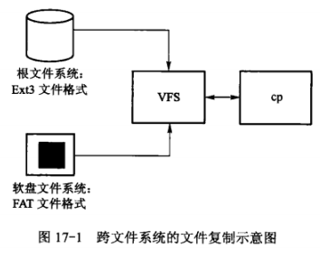
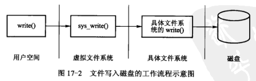
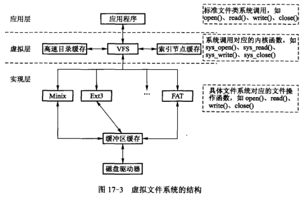

​	VPS定义一系列标准的数据结构与操作，基于这些数据结构与操作实现VFS框架。在该框架中，VFS提供独立于具体文件系统的通用文件操作，提供索引节点缓存、目录高速缓存等用于提高文件系统效率的缓存模块。由于VFS基本上是按UNIX类文件抽象的，对于非UNIX类文件系统，如Windows的FAT或NTFS等，要想能被VFS支持，它们的文件系统代码必须提供这些该年的模拟形式。例如，即时文件系统不支持索引节点，它也必须在主存中装配索引节点结构体（如同本身固有一样）。或者如果某文件系统将目录看做是一种特殊对象，那么要想使用VFS，必须将目录重新表示为文件形式。通常，这种转换需要在使用现场引入特殊处理，使非UNIX类文件系统能够兼容UNXI类文件系统的使用规则和满足VFS的需求。通过这些处理，非UNIX类文件系统便可以和VFS一同工作，但性能上多少会受些影响。当一个具体文件系统接入VFS后，就能享受到VFS提供的各种缓存带来的好处。

## 文件系统的安装和挂载

​	VFS支持的文件可划分为3种主要类型。

1. 磁盘文件

   ​	基于磁盘的文件系统管理本地磁盘分区中可用的存储空间，这种文件的“文件数据”存放在磁盘的数据快中，“文件管理信息”存放在磁盘的索引节点中。

2. 设备文件

   ​	设备文件同样有“文件管理信息”，而且也存储在索引节点中，但却不一定在磁盘上存储数据。根据设备类型和性质的不同，它可以是用于存储/读出的（如磁盘）、也可以是接收/发送的（如网络卡）、还可以是供采集/控制的（如机电设备）等，不管什么设备，在操作过程中总要伴随着一定程度的数据采集和控制，这可通过设备接口上的“控制/状态寄存器”进行。用于访问其他网络计算机所包含的文件系统，也作为设备文件处理。

3. 特殊文件

   ​	特殊文件有“文件管理信息”，但不一定在磁盘上有索引节点，即不管理具体的磁盘空间，且它一般都与外部设备无关，涉及的介质通常为主存或CPU。当从一个特殊文件“读”时，所读出的数据都是由系统内部按一定规则临时生成，或从主存中收集、加工出来的，反之亦然。特殊文件例子有/proc、/dev/null、命名管道和套接字等。

​	各种不同的文件系统通过mount挂载和安装到根文件系统中。在Linux中，根文件系统通常是Ext2或Ext3文件系统。当进程或Shell命令访问目录和文件时，先调用库函数，再调用对应内核函数，进入内核态后将遍历VFS的VFS索引节点，而VFS索引节点将会指向具体文件系统的索引节点，再通过底层块I/O函数来调用块驱动程序访问块设备（磁盘），从而得到文件数据。VFS对文件系统中具有共性的上层和底层进行处理，对上层进行处理的工作有：文件路径查找、文件读写共性操作处理；对底层进行处理的工作有：各种高速缓存（如页缓存）处理。

​	**VFS要与具体的文件系统相联系，需要将这个具体文件系统注册并挂载到VFS上**。文件系统注册是一种文件系统被安装到VFS上时需要做的首要工作。向内核**注册**一个新文件系统有两种途径：一种是在编译内核时确定，并在系统初始化时通过内嵌的函数调用向注册链表登记；另一种则是利用Linux的内核模块机制，把文件系统当作一个内核模块。文件系统的**挂载**，主要通过mount命令把具体文件系统的根目录挂载到系统目录树的某个目录下（一般是/mnt），这个挂载的系统目录被称为**安装点（mount point）**。

​	VFS提供标准的数据结构来描述某个特定文件系统的**类型**和一个已安装文件系统的**实例**，分别是file_system_type机构体和vfsmount结构体。每个文件系统不管有多少个实例安装到系统中，还是根本就没有安装到系统中，都**只有一个**file_system_type结构。而安装一个文件系统时，将在安装点创建一个vfsmount结构体。该结构体用来代表文件系统的实例，即代表一个安装点。

## 虚拟文件系统的结构和通用文件模型

​	从面向对象的角度来说，VFS定义一个文件系统的基类，并基于该基类实现一个文件系统的框架。如果一个文件系统（如Ext3）需要接入VFS中，该文件系统只需要提供继承VFS标准基类的一个子类即可。

​	**VFS实质上是一种存在于主存中，支持多种类型具体文件系统运行环境**，其功能包括：

* 记录安装的文件系统类型。
* 建立设备与文件系统的联系。
* 处理面向文件的通用操作。
* 涉及具体文件系统的操作时，把这些操作映射到具体文件系统中执行。

​	VFS有自己的通用文件模型，该模型主要定义以下4种对象：

* 超级块（SuperBlock）对象：代表一个已安装的文件系统，存放已安装文件系统的信息。如果是基于磁盘的文件系统，该对象便对应于存放在磁盘上的**文件系统控制块**，每个文件系统都对应一个超级块对象。
* 索引节点（inode）对象：代表一个文件。存放通用的文件信息，如果是基于磁盘的文件系统，该对象通常对应于存放在磁盘上的**文件控制块**，每个文件都有一个索引节点对象，而每个索引节点都有一个索引节点号，该号为已地标识某个文件系统种的指定文件。
* 目录项（Dentry）对象：代表路径中的一个组成成分。存放目录项与对应文件进行链接的各种信息。VFS把最近经常使用的目录项对象放在目录项高速缓存中，加快文件路径名搜索过程，以提高系统性能。
* 文件（File）对象：代表进程已打开的一个文件。存放已打开的文件与进程的交互信息，这些信息仅当进程访问文件期间才存在于主存中。

