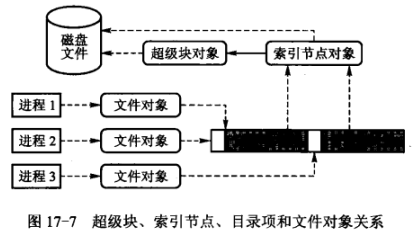
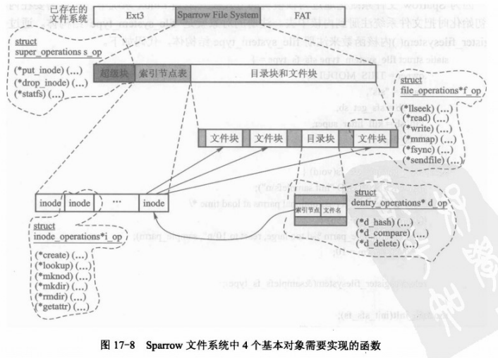
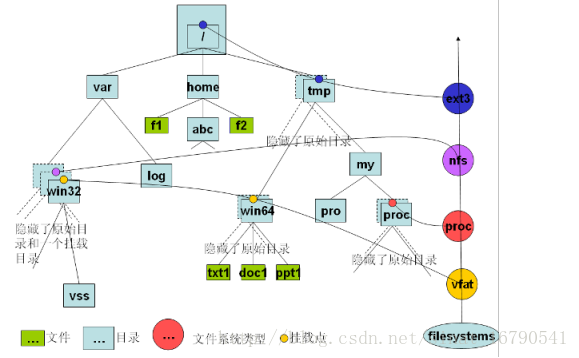

# 简易Sparrow文件系统

超级块、索引节点、目录项和文件这4种对象的关系如图所示。

4个基本对象，其所包含的操作对象中锁必需实现的函数指针，以及这4个基本对象的关系如图所示。

Sparrow文件系统是通过内核模块的方式被安装到Linux系统中，所以需要在内核模块初始化时把文件系统注册到内核中。注册的对象就是file_system_type。

https://blog.csdn.net/sinat_16790541/article/details/40023267

## Linux文件系统的组织形式

​	Linux中使用树来组织文件系统。整个文件系统构成了一颗树，这棵树以/为根。整个系统有且只有这一颗文件树。这棵树描述了文件系统的拓扑结构，没有任何文件系统的类型信息。

## mount机制

​	Linux使用mount机制扩展文件系统，使不同类型的文件系统可以挂载在系统的文件树的任何位置。mount机制使文件树有了类型属性，支持了不同类型的文件系统的挂载。

## 文件系统注册过程

​	Linux内核是可加载的，许多模块式可选的，只有真正需要使用时才加载他们。文件系统注册过程就是把对应某类型文件系统相关的模块加载到内核，并创建相关的数据结构。每个文件系统模块都有一个初始化例程，它的作用就是VFS中进行注册，即填写一个叫做file_system_type的数据结构。所有已注册的文件系统的file_system_type结构形成一个链表，我们把这个链表称为注册链表。

​	每个设备在mount时都要搜索该注册链表，选择适合自己设备文件系统的一项，并从中取出read_super()函数获取设备的超级块（存储在具体设备上，记录存储设备各种信息的一个存储块），并解析其内容。因为每种类型文件系统的超级块的格式不同，并且各自有特定的信息，每种文件系统必须使用对应的解析函数，否则内核就因为不认识该文件系统而无法完成安装。这就是注册文件系统的意义所在。

## 安装连接件vfsmount

1. 创建一个设备的vfsmount。
2. 为“被安装设备”创建一个super_block，并由具体的文件系统来设置这个super_block。在super_block中包含了该类型设备操作的各种接口的结构成员s_op，类型为super_operations。
3. 为“被安装设备”的根目录节点创建dentry。
4. 为“被安装设备”的根目录节点创建inode，并由super_block->s_op->read_inode()来设置此inode。
5. 将super_block与“被安装设备”根目录节点dentry关联起来。
6. 将super_block中的s_root与“被安装设备”的根目录节点dentry关联起来。