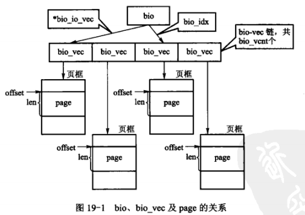
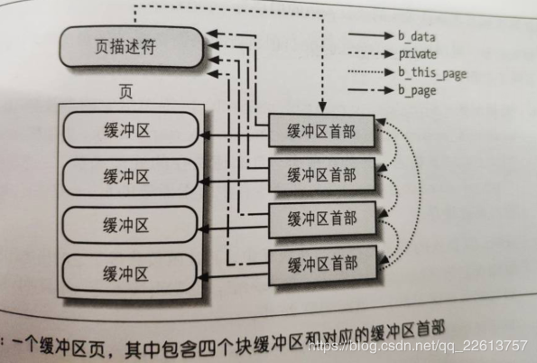
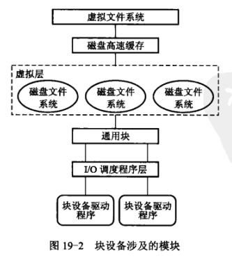

## 设备文件的VFS处理

​	用户通过相同的一组函数访问设备文件与普通文件。访问普通文件时，文件系统将用户的操作转换称对磁盘分区中数据块的操作；访问设备文件时，文件系统需要将用户的操作转换成对**设备的驱动**操作。

​	在VFS中，每个文件都有一个索引节点与之对应。在内核的inode结构中，由一个名为i_fop成员，其类型为file_operations。file_operations定义文件的各种操作，用户对文件的操作是通过调用file_operations来实现的。为了使用户对设备文件的操作能够转换成对设备的驱动操作，VFS必须在设备文件打开时，改变其inode结构中i_fop结构的默认值，将该值替换成与该设备相关的具体函数操作。

​	当用户准备对设备文件进行访问时，文件系统读取设备文件在**磁盘上**相应的索引节点，并存入主存inode结构中。内核将文件的主设备号与次设备号写入inode结构中的i_rdev字段，并将i_fop字段设置成def_blk_fops（如果为块设备）或def_chr_fops（如果为字符设备）。通过这样的设置，用户对设备文件的操作便能转换成对设备的驱动操作。

## 字符设备

### 申请与释放设备编号

​	驱动程序一般通过模块加载，可在模块的初始化函数进行设备号的申请，并在模块的清理函数中，对设备号进行释放。

### 设备注册与注销

## 块设备

### 申请与释放设备编号

### 注册磁盘

​	内核中由gendisk结构表示一个独立的磁盘设备，块设备驱动程序在注册主设备号之后，需要设置gendisk结构，并将该结构添加到内核中。

​	gendisk是一个动态分配的结构，它需要内核的特殊处理来进行初始化，驱动程序不能自己动态分配该结构，而是必须执行内核函数alloc_disk(int)。

### bio结构体

​	在大多数情况下，磁盘控制其采用**DMA**方式进行数据传输。块设备驱动程序只需要向磁盘控制器发送一条指令，它就能一次性传输主存中的多块数据。待数据传输完毕后，磁盘控制器再发出一个结束中断，通知设备驱动程序。老式磁盘控制器再采用DMA方式时，只允许传送**主存中连续**的数据。新的磁盘控制器支持**聚散I/O**，它能够传输**主存中不邻接**的数据块。

​	Linux早期内核版本中，块设备I/O通过操作内核I/O缓冲区（I/O buffer）进行。自v2.5内核版本起，为块设备引入一种新型、灵活的容器bio结构体来实现I/O。该结构体代表正在活动的、以**片段（segment）链表**形式组织的块I/O操作，一个片段是需要传递的一小块连续的主存缓冲区。这样，就不需要保证单个缓冲区一定要连续。通过用片段来描述缓冲区，即使一个缓冲区分散在主存的多个位置上，bio结构体也能对内核保证I/O操作的执行，像这样的向量I/O就是所谓的聚散I/O。



### 请求队列

​	块设备将它们挂起的块I/O请求保存在请求队列中，该队列由request_queue结构体表示，包含一个双向请求链表及相关控制信息。通过内核中像文件系统这样高层的代码将请求加入到队列中。请求队列只要不为空，队列对应的块设备驱动程序就会从队列头获取请求，然后将其送入对应的块设备上去。请求队列表中的每一项都是一个单独的请求，由request结构体表示。因为一个请求可能要操作多个连续的磁盘块，所以每个请求可由bio结构体组成，虽然磁盘上的块必须连续，但是在主存中这些块并不一定要连续，每个bio结构体都可以描述多个片段，而每个请求页可以包含多个bio结构体。

​	块I/O层建立请求结构体request后，把它放在请求队列中，然后传递给底层驱动程序，**触发驱动程序的request_fn()内核函数**来处理请求，驱动程序利用块I/O层的elv_next_request()内核函数把下一个请求移出队列。

### 页高速缓存

​	在linux内核旧版本中，主要有两种不同的磁盘高速缓存：**页高速缓存**和**缓冲区高速缓存**，前者用来存放磁盘文件内容时生成的**磁盘数据页**，后者把VFS访问的**块**的内容保留在内存中。当时2.4.10后缓冲区高速缓存不再存在。也就是我们说的buffer cache不再存在，而是统一都存放进了page cache中，把它们存放在叫做“缓冲区页”的专门页中。

​	缓冲区页在形式就是与称作“**缓冲区首部**”的附加描述符相关的数据页，主要目的是快速确定页中的一个**块**在磁盘中的地址。

```c
// 缓冲区首部的字段
unsigned long b_state    // 缓冲区状态标志
struct buffer_head *b_this_page    // 指向缓冲区页的链表中的下一个元素的指针
struct page *b_ page    // 指向拥有该块的缓冲区页的表舒服指针。
atomic_t b_count    // 块使用计数器
u32 b_size    // 块大小
sector_t b_blocknr    // 与块设备相关的块号（逻辑块号）
char *b_data    // 快在缓冲区页内的位置
struct block_device *b_bdev    // 指向块设备描述符的指针
bh_end_io_t *b_end_io    // I/O完成方法
void *b_private    // 指向I/O完成方法数据的指针
struct list_head b_assoc_buffers     // 为与某个索引节点相关的间接块的链表提供的指针。
```

* 两个字段编码表示块的磁盘地址：b_bdev字段表示包含块的块设备，通常是磁盘或分区；而b_blocknr字段存放逻辑块号，即块在磁盘或分区中的编号。
* b_data表示块缓冲区子缓冲区页中的位置，如果在内存，存放的是块缓冲区相对页的起始位置的偏移量，否则存放块缓冲区的线性地址。
* b_state 存放标志。



### pdflush内核线程

​	由与页高速缓存的缓存作用，写操作实际上会被延迟，当页高速缓存中的数据比磁盘存储的数据更加新时，那么该数据就被称作脏数据，在主存中累积起来的脏页最终必须被**写回磁盘**。在以下情况发生时，脏页被写回磁盘：

* 当空闲主存低于特定的阈值时，内核必须将脏页写回磁盘，以便释放主存。
* 当脏页在主存中驻留时间超过特定的阈值时，内核必须将超时的脏页写回磁盘，以确保脏页不会无限期地驻留在主存。

### 块设备文件的读写操作



## 磁盘I/O调度程序

