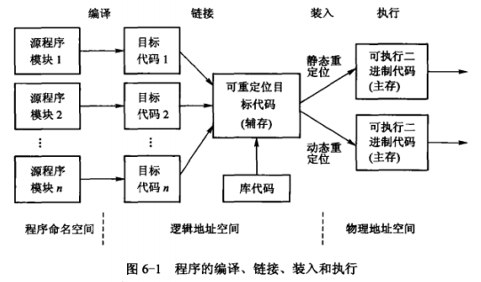

# 存储管理涉及的基本概念
## 程序的编译、链接、装入和执行
​	应用程序大都使用高级程序设计语言或汇编语言编写，所编写的程序成为源程序。源程序中的符号名集合限定的空间称程序命名空间，源程序是不能被计算机直接执行的，需要通过如图所示的3个阶段处理后才能装入主存执行。

### 编译

​	源程序经过编译程序或汇编程序处理来获得目标代码（也称目标模块），一个程序可由许多独立编写且具有不同功能的源程序模块组成。在C程序设计模型中，至少分3个程序模块：文本段、数据段和堆栈段。由于模块会包含外部引用，即指向其他模块中的数据或指令的操作数地址，或包含对库函数的引用，编译或汇编程序负责记录引用发生的位置，处理后产生相应的多个目标代码模块。每个都附有供引用使用的内部符号表和外部符号表。符号表中依次给出每个符号名及在本目标代码模块中的名字地址，在模块被链接时进行转换。

### 链接

​	链接程序的作用是把多个目标代码模块链接成一个完整的**可重定位**目标程序（其中包括应用程序要调用的标准库中的函数，引用的其他模块中的子程序），需要解析内部和外部符号表，把对符号名字的引用转换为数值引用，要将每个涉及名字地址的程序入口点和数据引用点转换为数值地址。可重定位目标程序又称装入代码模块，它被存放在磁盘中，由于程序在主存中的位置不可预知，链接程序地址空间中的地址总是相对某个基准（通常为0）开始编号的顺序地址，称为逻辑地址或相对地址。

### 装入

​	在装入一个可重定位目标程序之前，存储管理程序总会分配一个块实际主存给进程。装入程序根据指定的主存块首地址，再次修改和调整被装入模块中的每个逻辑地址，**将逻辑地址绑定到物理地址**，使之成为可执行二进制代码。这样，就可使用逻辑地址来引用分配到主存物理块内相应的物理地址，将再次修改和调整的可重定位目标程序复制到指定内存块中，以便进程在物理地址空间中执行。

​	**在磁盘中的可重定位目标程序使用的是逻辑地址**，它的逻辑地址集合称为该进程的逻辑地址空间。逻辑地址空间可以是一维的，这时逻辑地址限制在从0开始顺序排列的地址空间中；也可以是二维的，这时整个进程被分为若干段，每段有不同的段号，段内地址从0开始顺序编址。进程运行时，它的可重定位目标程序将被装入物理主存地址空间中，此时程序和数据的实际地址一般不可能和原来的逻辑地址一致。**物理主存中从统一的基址开始顺序编址的存储单元称为物理地址或绝对地址**，物理地址的总体构成物理地址空间，注意，物理地址空间是由主存储器地址总线扫描出来的空间，其大小取决于实际安装的主存容量。

## 逻辑地址和物理地址

​	用户（目标）程序使用的地址空间中的每个地址单元称逻辑地址。由于逻辑地址通常相对于程序的起始地址，故也称相对地址；主存物理地址空间中的每个地址单元称物理地址或绝对地址，绝对地址可直接寻址。

## 静态分配和动态分配

​	作业所需主存空间是在装入时分配的，在其整个运行期间，一直占用且不能再申请新的主存空间，也不允许作业在主存中“移动”，称静态存储分配，简称静态分配。允许运行中的作业继续申请附加的主存空间，系统也可根据需要将程序或数据从主存的一个区域移动到另一个区域，以及从主存调至外存对换区或反之，称动态存储分配，简称动态分配。

## 静态重定位和动态重定位

​	作业的地址空间与物理空间不一致时，进行地址调整以便作业能够运行的过程称为重定位，其实质是地址映射，即作业地址空间中的逻辑地址转换为存储空间中的物理地址。

​	由装入程序实现可重定位目标程序的装入和地址转换，把它转入分给进程的主存指定区域，其中的所有逻辑地址修改成主存物理地址，称静态重定位。地址转换工作在进程执行前一次完成，作业执行期间不再进行地址修改，也不允许作业在主存中移动。

​	由装入程序实现可重定位目标程序的装入，把它装入分给进程的主存指定区域，程序主存起始地址被置入硬件专用寄存器——重定位寄存器，程序执行过程中，每当CPU引用主存地址（访问程序和数据）时，由硬件截取该逻辑地址，并且在它被发送到主存之前加上重定位寄存器的值，以实现地址转换，称动态重定位，地址转换推迟到最后可能的时刻，即进程执行时才完成。

## 实存管理和虚存管理

​	如果在作业被启动运行之前，由操作系统为它分配足够的主存空间，来装入其全部信息以便运行，则称为物理存储管理（简称实存管理）。如果在作业被启动运行之前，仅将当前使用部分先装入主存，其余部分存放在磁盘，待用到时由系统自动把它们装入以便运行，则称虚拟存储管理（简称虚存管理）。