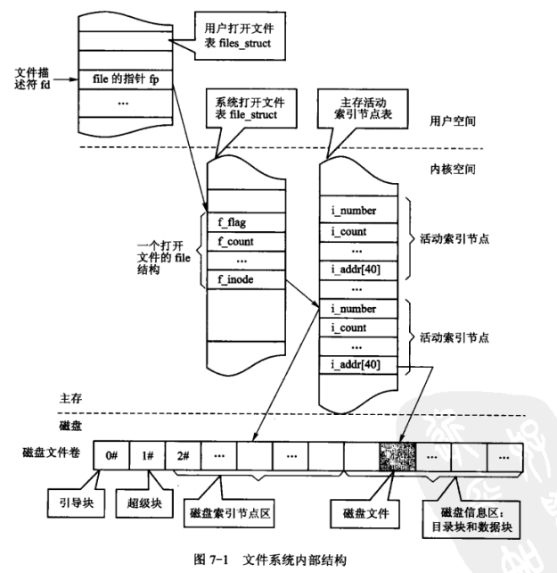

## UNIX类文件系统和非UNIX类文件系统

​	UNIX类文件使用4种和文件系统相关的抽象概念：文件、目录项、索引节点和安装点。

* 文件（file）：文件是由文件名标识的有序字节串，典型的配套文件操作有读、写、创建和删除等。
* 目录项（dentry）：目录项是文件路径名中的一部分，例如/home/fei/fei1.c，其中/、home、fei和fei1.c都是目录项。
* 索引节点（inode）：索引节点是存放文件控制信息的数据结构，又分磁盘块中的索引节点和主存中活动的索引节点。
* 安装点（mount point）：文件系统被安装在一个特定的安装点上，所有的已安装文件系统都作为根文件系统树中的叶子出现在系统中。

​	Linux的Ext2和Ext3是UNIX类文件系统。Windows的FAT和NTFS属于非UNIX类文件系统，它们的实现采用其他方法。

## 文件控制块和文件目录

​	文件控制块（file control block，FCB）是文件系统给每个文件建立的唯一管理数据结构，一个文件由两部分组成：FCB和文件体（文件信息）。FCB一般应该包括文件标识和控制信息、文件逻辑结构信息、文件物理结构信息、文件使用信息、文件管理信息等。

​	文件目录是FCB的有序集合，它包含许多目录项。目录项有两种，分别用于描述子目录和FCB。通常将文件目录以文件形式保存在磁盘上，这种仅包含目录项的文件就称目录文件。

​	文件目录可组织成一级目录结构、二级目录结构和树形目录结构。树形目录结构中包含根目录、子目录、当前目录、路径名、绝对路径名和相对路径名等概念。

​	文件存取方式包括顺序存取、直接存取和索引存取。

​	文件函数由建立文件、打开文件、关闭文件、读文件、写文件、删除文件和控制文件。

# 文件管理的数据结构

## 磁盘上文件空间的组织

​	文件是对设备的一种抽象，而且是对磁盘设备进行多层次抽象的结果。

1. 第一层抽象，从磁盘到分区。一个物理磁盘可划分成分区，每个分区可从逻辑上看作是一个独立的磁盘，可安装和驻留一个文件系统。
2. 第二层抽象，从分区到扇区。磁盘由柱面号、磁道号和扇区号来定位，扇区是磁盘上的基本存储单元，例如每个扇区存储1KB，可从外向里一个柱面接一个柱面，一个磁道接一个磁道给每个扇区编号。将磁盘扇区编号的系统使将磁盘编成一系列扇区的集合。
3. 第三层抽象，从扇区到簇。不同磁盘的扇区大小可能不同，通过系统软件屏蔽这一事实并向高层软件提供统一的数据块尺寸，将若干扇区合并为一个逻辑块，称簇，再按簇进行编号，这样高层软件就只和大小都相同的簇交互，而不管物理扇区的尺寸。
4. 第四层抽象，从簇到文件系统分区。内核再将簇序列分成超级块、索引节点区和数据块区等，再加上各种组织、控制和管理信息的软件便形成文件和文件系统。

​	扇区序列分成以下3个部分。

* 超级块：占用1#号块，存放文件系统结构和管理信息。
* 索引节点区：2#~(k+1)#块，存放索引节点表。索引节点记录文件属性，每个索引节点都有相同的大小和唯一的编号；文件系统中的每个文件在该表中都有一个索引节点。
* 数据区：(k+2)#~n#为数据块，文件的内容保存在这个区域的块中。

​	文件系统内部结构如图所示。

## 主存中文件管理的数据结构

​	操作系统在主存中用于管理文件的数据结构包括以下3种。

1. 系统打开文件表

   ​	这是为解决多用户进程共享文件、父子进程共享文件而设置的系统数据结构。打开一个文件时，通过系统打开文件表的表项把用户打开文件表的表项与文件活动索引节点链接起来，以实现数据的访问和信息的共享。

2. 用户打开文件表

   ​	进程的PCB结构中建立一张用户打开文件表或称文件描述符表，表项的序号为文件描述符，该登记项内登记系统打开文件表的一个入口指针，通过此系统打开文件表的表项连接到打开文件的活动索引节点。

3. 主存索引节点表

   ​	这是为解决频繁访问磁盘索引节点表的效率问题，系统开辟的主存区，正在使用的文件的索引节点被调入主存活动索引节点中，以加快文件访问的速度。