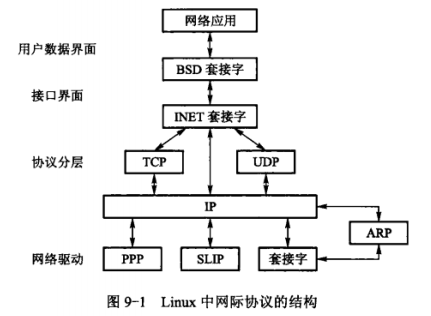

# 网间进程通信协议

## TCP/IP协议族

​	TCP/IP是网间进程通信的协议基础，它是由TCP协议、IP协议、用户数据报文协议（UserDatagram，UDP）、因特网控制消息协议（Internet Control Message Protocol，ICMP）及其他协议组成的一个协议族。该协议族定义计算机通过网络互相通信及协议族各层次之间通信的规范，所有使用或实现某种Internet服务的程序都必须使用该协议族。其中IP协议、TCP协议及UDP协议是最为根本的3种协议，是所有其他协议的基础。从协议分层来看，IP是网络层协议，TCP协议及UDP协议属于传输层协议。

​	IP协议是TCP/IP协议族的心脏，也是网络层中最重要的协议。它定义数据按照数据报（Datagram）传输的格式和规则。IP层接收由更低层（网络接口层，如以太网设备驱动程序）发来的数据报，并把该数据报发送到更高层——TCP层或UDP层；与此同时，IP层也负责把从TCP或UDP层接收来的数据报传送到更低层。需要注意，IP层不提供任何报文检测机制，无法确认报文是否按序传输或正确处理，因此IP数据报是不可靠的。IP数据报中含有报文发送者的地址（源地址）及报文接收者的地址（目的地址）。利用IP层传输报文时，当目的方网际协议层收到IP报文后，必须识别出该报文所使用的上层协议（即传输层协议），因此，在IP报头中，设有一个“协议”域，通过该域的值，即可判明其上层协议类型。

​	TCP协议建立在IP协议之上，定义网络上程序与程序之间的数据传输格式和规则，提供IP数据报的流量控制、传输确认、丢失数据报的重传请求、将收到的数据报按照它们的发送次序重新装配的机制，保证数据传输的可靠性和有序性。TCP协议是一个可靠的端到端的传输层协议，提供面向连接的数据报服务，**该服务模式是电话系统服务模式的抽象**，每一次完整的数据传输都要经过建立连接、使用连接、终止连接的过程。在数据传输过程中，各数据分组不携带目的地址，而使用连接号（connection ID）。本质上，连接是一个管道，收发数据不但顺序一致，而且内容相同。

​	与TCP协议相似，UDP协议也建立在IP协议之上。但与TCP协议的有连接服务特征不同，UDP协议是一种无连接协议，提供无连接的数据报服务。**该服务模式是邮政系统服务的抽象**。无需在数据传输前建立明确的连接。每个UDP报文都携带完整的目的地址，各报文可独立地从数据源传送到终点。UDP协议不保证数据传输的可靠性，也不提供报文顺序重排或请求重传功能，无连接服务不能保证分组的先后顺序，不进行分组出错的恢复与重传。这种不可靠性一方面限制UDP协议的应用场合，但另一方面也使得它比TCP协议具有更好的传输效率。

​	图9-1描述Linux对IP协议族的实现机制。Linux支持BSD的套接字和全部的TCP/IP协议，是通过网络协议将其视为一组相连的软件层来实现的，BSD套接字由通用的套接字管理软件支持，该软件是INET套接字层，用来管理基于IP的TCP与UDP端口到端口的互联问题。

​	选择TCP协议还是UDP协议取决于应用程序的要求。可以从以下几方面考虑。

* 是否需要确认信息？若应用程序需要从客户端或服务器端得到确认信息，则使用TCP协议，并在收发数据之前先建立连接，如FTP服务。而UDP协议更适用于可容忍一定范围数据传输差错率的应用系统，如流服务。
* 数据传输量规模。由于UDP协议不提供端到端的流控制机制，因此基于UDP协议的大规模数据传输容易引起网络拥塞，并造成UDP流“饿死”现象。而TCP协议的面向连接服务可有效避免网络拥塞并确保数据的完整性，但面向连接需要更多的计算资源，因而代价较为“昂贵”。
* 数据发送频次，即数据传输是间歇的，还是在一个会话内完成？TCP协议在连接双方发送数据之前，都需要首先建立一条连接。该连接的完成需要经过3次握手过程，耗时较长。因此，TCP协议较适合可在一个会话内完成的数据通信，而UDP协议更适宜于间歇性数据传输。

## 网络地址

​	网络环境中相互通信的两个进程分别在不同的计算机上。在互联网中，两台计算机可能位于网络互联设备（网关，网桥，路由器等）连接的异构网络中。因此，网间进程的识别与定位需要经过三级寻址。

* 某一主机可与多个网络相连，必须指定一特定网络地址。
* 网络上每一台主机应有其唯一的地址。
* 每一主机上的每一进程应有在该主机上的唯一标识符。

​	通常主机地址由网络ID和主机ID组成，在TCP/IP协议中，用32位整数值表示；TCP协议和UDP协议均使用16位端口号标识用户进程。

## 协议端口

​	按照OSI七层协议的描述，传输层与网络层在功能上的最大区别是传输层提供进程间通信能力。在进程通信的意义上，网络通信的最终地址不仅仅是主机地址，还包括可以描述进程的某种标识符，为此，TCP/UDP提出了协议端口（protocol port）的概念，用于标识通信的进程。

​	**端口是一种抽象的软件结构（包括一些数据结构和I/O缓冲区）**，被客户程序或服务进程用来发送和接收信息。进程通过函数与某端口建立连接后，传输层传给该端口的数据都被相应进程所接收，相应进程发给传输层的数据都通过该端口输出。在TCP/IP协议的实现中，端口操作类似于一般的I/O操作，进程获取一个端口，相当于获取本地唯一的I/O文件，可以用一般的读写原语访问。服务进程通常使用一个固定的端口，类似于文件描述符，每个端口都拥有一个称为端口号（Port Number）的整数型标识符，用于区别不同端口。**由于TCP/IP传输层的两个协议TCP和UDP是完全独立的两个软件模块，因此各自的端口号也相互独立**，如TCP协议有一个255号端口，UDP协议也可以有一个255号端口，两者并不冲突。

​	端口号的分配是一个重要问题。有两个基本分配方式：第1种叫全局分配，是一种集中控制方式，由一个公认的中央机构根据用户需要进行统一分配，并将结果公布于众；第2种是本地分配，又称动态连接，即进程需要访问传输层服务时，向本地操作系统提出申请，操作系统返回一个本地唯一的端口号，进程再通过合适的函数将自己与该端口号绑定起来。TCP/IP端口号的分配中综合上述两种方式，TCP/IP将端口号分为两部分，少量的作为保留端口，以全局方式分配给服务进程。因此，每一个标准服务器都拥有一个全局公认的端口，即使再不同计算机上，其端口号也相同。剩余的为自由端口，以本地方式进行分配。TCP协议和UDP协议均规定，小于256的端口号才能作保留端口。

​	综上所述，网络中用一个三元组可以在全局唯一标志一个进程：（协议，本地地址，本地端口号）。这个三元组称为一个半相关（Half-Association），它指定连接的一端。

​	而一个完整的网间进程通信需要由两个进程组成，并且只能使用同一种高层协议。也就是说，不可能通信的一端用TCP协议，而另一端用UDP协议。因此一个完整的网间通信需要一个五元组来标识：（协议，本地地址，本地端口号，远地地址，远地端口号）。这个五元组称为一个相关（Association），即两个协议相同的半相关才能组合成一个合适的相关，或完全指定组成一连接。

## 通信服务模式

​	在TCP/IP网络应用中，通信的两个进程间相互作用的主要模式是客户/服务器（Client/Server）模式，即客户向服务器发出服务请求，服务器接收到请求后，提供相应的服务。客户/服务器模式在操作过程中采取的是主动请求方式，服务器首先启动服务，客户在需要相应服务时向服务器提出服务请求。